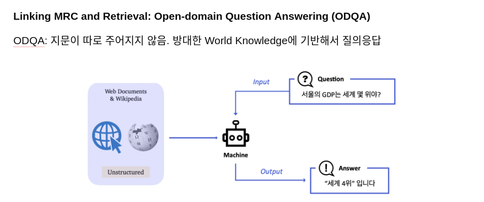

# MRC 대회 랩업리포트


<br/><br/>
# 대회 회고

## 목차

1. **Overview**
2. **Timeline**
3. **Solution**
4. **Things that Didn’t Work**
5. **SOTA(단일모델)**
6. **Ensemble**
7. **Results**
8. **깨달은 점**
9. **References**

## 1. Overview

- Question Answering(QA): 다양한 종류의 질문에 대해 대답하는 Task

  - Open-Domain Question Answering(ODQA): 주어지는 지문이 따로 존재하지 않고 사전에 구축되어 있는 Knowledge Resource에서 질문에 대답할 수 있는 문서를 찾는 과정이 추가된 Task

    

- 구조

  - Retriever: 질문과 관련된 문서를 찾아주는 단계
  - Reader: 관련된 문서를 읽고 적절한 답변을 찾거나 만들어주는 단계

- 데이터셋

  

  - MRC 데이터: `pyarrow` 형식으로 저장되어 있음.
  - Wiki 문서 corpus: 약 5만 7천개의 unique 문서로 구성
  - 구성

  ```python
  {"id": 질문의 고유 id,
  "question": 질문,
  "answers": 답변에 대한 정보. 하나의 질문에 하나의 답변만 존재함,
  "answer_start": 답변의 시작 위치,
  "text": 답변의 텍스트,
  "context": 답변이 포함된 문서,
  "title": 문서의 제목,
  "document_id": 문서의 고유 id}
  ```

- 평가 지표

  - Exact Match(EM)

    - 모델의 예측과 실제 답이 정확하게 일치할 때만 점수를 부여, 이때 답이 하나 이상 존재하게 된다면 하나라도 일치하면 정답으로 간주

  - F1 Score

    - 겹치는 단어를 고려해 점수를 부여

    

## 2. Timeline


## 3. Solution

- Model Selection

  - KLUE/RoBERTa-Large (Reader)
    - KLUE 논문에서 MRC 성능이 가장 좋았던 모델.
    - 이 대회는 context를 따로 붙여줘야 하는 ODQA task였지만, train/test데이터는 KLUE의 MRC 데이터를 쓰기 때문에 본 모델을 주력으로 선택.
  - XLM-RoBERTa-Large (Reader)
    - 전통적으로 한국어 NLP task에서 기본 이상의 성능을 보이는 모델.
    - 효율적인 앙상블을 위해 다국어 모델 중 한국어 성능이 좋은 모델을 채택.

- Hyperparameter Tuning

  - doc_stride
    - context가 max_len을 넘길 때 겹치는 부분의 하이퍼 파라미터로 클수록 no_answer 비율이 많아짐을 확인
    - train/loss가 더 높더라도, em과 f1이 상승하는 추세인 모델이 더 좋은 성능을 보이는 것을 확인

- Sparse retrieval

  - TF-IDF
    - Dense Passage Retrieval for Open-Domain Question Answering(2020)의 논문에서 top-k를 20~100까지도 늘려서 사용하는 것을 확인.
    - baseline의 tf-idf의 top-k를 최대한 늘려서 실험 진행.
    - retrieval accuracy (train+eval 데이터셋으로 측정)
      - top_k 20: 72.7 → top_k 100: 87.2
    - LB EM
      - top_k 20: 48.89 → top_k 100: 56.67
    - 확실히 top_k를 늘려 retrieval accuracy를 높이는 것이 성능 향상에 도움이 되는 것을 확인
  - Elastic Search
    - 비 정형 데이터 검색에 최적화된 방법 사용
    - 토크나이저로 nori_tokenizer와 토크나이저 filter로 shingle을 사용
    - 유사도 측정은 BM25를 사용
    - retrieval accuracy (top_k 30 기준)
      - TF-IDF: 77.1
      - Elastic Search: 93.3
    - LB EM
      - TF-IDF: 48.89
      - Elastic Search: 60.83

- Eval Loss

  

  - Baseline Code에선 Eval Loss 계산 기능이 빠져 있었음.
  - Evaluation 작업에서 반환된 predict/label의 start, end position을 기반으로 cross entropy를 계산하여 eval_loss를 기록.
  - 이를 통해 모델 학습 과정에서 학습 효율과 방향성을 확인 할 수 있는 지표를 추가 확보.

- TAPT(with korquad 1.0)

  - XLM-RoBERTa-Large pretrained 모델은 다국어 사양이라, 모델을 한국어 NLP에 특화 시키는 TAPT(Task Adaptive Pre-Training) 과정을 선행적으로 수행할 필요가 있었음.
  - TAPT에 사용할 데이터셋으로 KLUE MRC 데이터셋과 유사한 형태를 가지는 KorQuAD 1.0 데이터셋을 활용, 약 6만여개의 데이터로 XLM-RoBERTa-Large 모델의 TAPT를 수행.
  - 일련의 KorQuAD TAPT를 수행한 것과, 수행하지 않은 모델을 비교했을 때, XLM-RoBERTa-Large 모델은 대회 Task에서 Public EM 10점 상승.
  - KorQuAD TAPT가 모델이 데이터를 바라보는 시각을 어느 정도 변형 시킨다는 가설을 세우고, KLUE/RoBERTa-Large 모델에도 이를 적용, Public EM은 소폭 하락하지만, inference를 통해 도출한 답변의 전체적인 양상이 달라짐을 확인.

- context 데이터에 title 추가

  - 개요
    - 입력 데이터로 title 주는 것을 확인. 모델에 context를 넣어줄 때, title을 @로 래핑 하여 뒤에 부착.
  - front title 추가 구현
    - title을 context 앞에 붙여줄 때, 전체 답변 데이터의 인덱스 위치가 달라지는 것을 반영.

- Data Augmentation

  - No_answer_data
    - KLUE 논문에서 제안한 방식: context와 관계된 질문을 붙여주나, 논리적인 답을 구할 수 없는 상태일 것
    - 따라서 기존 4천여개의 train 데이터셋과 위키 corpus 사이를 비교하며
      - title은 같지만, context는 기존 question과 매칭 되지 않았던 것을 위키 corpus에서 선택
      - 이렇게 새로 선택된 (title 동일, context 다름) 조합을 question과 매칭
      - 의사적으로 ‘context와 관계된 질문’이지만, 논리적으로 답을 못 구하는 상태를 구현
      - answers의 형태(no_answer 전용 )
        - `{'answer_start': [-1], 'text': ['']}`
    - KLUE/RoBERTa-Large 모델의 훈련에 이 데이터를 적용, 기존 데이터셋으로 훈련했을 때 대비 Public EM은 다소 하락하지만, inference를 통해 도출한 답변의 전체적인 양상이 달라짐을 확인.
  - Paraphrased Question
    - `Pororo`의 paraphrasing 기능을 활용하여, 기본 학습 데이터의 질문 문장을 비슷한 문장으로 대체하여 데이터 증강을 꾀함.
    - 변형된 문장이 일부 단어의 동의어 치환 수준이었음.
    - 퀄리티의 문제로 모델 학습에 극적으로 긍정적인 효과는 없었으나, 학습 데이터의 양을 늘리기 위해 투입.

- Wiki-Data

  - 중복 제거
    - 기본적으로 제공된 Wikipedia 데이터셋의 text 부분이 중복으로 들어있는 것을 발견.
    - 이런 중복된 데이터를 제거함으로써 retriever가 중복으로 context를 갖고 오지 않도록 조치.

## 4. Things that Didn’t Work

- Dense Embedding
  - Dense Passage Retrieval for Open-Domain Question Answering(2020)에서 제안된 방법으로 베이스라인의 Sparse Embedding을 개선하고자 도입.
  - `RoBERTa` 를 인코더로 사용, negative sampling을 적용해 (Context-Question) 간 유사도를 높일 수 있는 방향으로 인코더를 학습하고, 학습된 인코더에 Wiki Corpus 문서와 질문을 입력해 해당 문서에 대한 Dense Embedding 생성
  - Retriever가 거의 정답을 맞추지 못하고 있었기 때문에 코드 자체에 문제가 있었을 것이라고 판단했지만, 대회 기간 동안 정확히 어디가 잘못되었는지 찾아내지 못했기 때문에 대회를 위해 사용하지 못함. 추후 코드를 다시 살펴보며 보완할 예정.
- Generation Based-MRC
  - T5-multilingual 모델을 이용하여 generation 기반의 mrc를 구현하려고 함.
  - extractive 모델과 많은 부분이 달라 코드 수정이 많이 필요했고, 실험한 결과 EM, f1, loss 등 다양한 수치들이 전반적으로 많이 낮게 나와 사용하지 못함.
  - 기존에 있는 적은 data(대략 4000개)로만 학습을 하려고 해서 성능이 나오기 힘들었다고 추정.
- Data Augmentation
  - Question Generation
    - 라이브러리: kakaobrain에서 공개한 `Pororo` 라이브러리의 `question_generation` 클래스 이용
      - KorQuAD 1.0 (Lim et al. 2019) + AI hub Reading Comprehension corpus + AI hub Commonsense corpus와 BART에 기반한 QG 모델
    - Wiki corpus 문서의 (제목-passage) 쌍을 입력해 해당 문서에 대한 질문 문장 생성
    - 생성한 질문에 대한 분석을 바탕으로 전처리가 필요했으나, ‘사실 여부가 다름’과 같이 제한된 시간 안에 처리할 수 있는 문제가 아니였기 때문에 이를 처리하지 못하고 바로 실험을 진행했기 때문에 성능이 잘 나오지 않았다고 분석
- Progressive Resizing
  - Image Resizing(이미지를 저해상도 → 고해상도 순으로 트레이닝)을 모방한 학습 방식.
  - input text size를 256 → 384 → 512 순으로 거듭하여 모델을 학습 시켰으나, 성능 하락만 보임.
  - 주어진 데이터의 절대량이 적기 때문에 의도대로 학습이 되지 않았던 것으로 추정.
- BM25
  - 기존 sparse retrieval로 사용하는 tf-idf를 대신해서 tf-idf를 개선한 BM25를 사용.
  - rank_bm25 라이브러리의 BM25 클라스를 사용했는데, TF-IDF보다 성능이 좋지 않았음.
  - bm25에 사용되는 context와 question에 대해 전처리나 tokenizer 사용이 미흡해서 성능이 하락한 것으로 분석.
- Wiki-Data
  - Context with Title
    - title을 context에 붙여서 훈련 시킨 reader 모델은 inference에서도 동일한 형태의 context를 보여 줄 시 성능이 오르리란 기대를 하여, wikipedia 데이터의 context에 대응되는 title을 붙임
    - 시도 결과, 유의미한 성능 변화를 보이지 않았고, 추가적인 실험을 하기엔 마감 기한이 촉박하여 포기
  - 한글 비율 낮은 data 삭제
    - wiki data에서 한글 비율이 70%이하인 데이터를 삭제하는 작업
    - 추가 실험을 하기에 마감 기한이 촉박하여 쓰지 못함

## 5. SOTA(단일 모델)

- LB public SOTA
  - model: klue/RoBERTa-large
  - hyperparameter
    - epoch: 2
    - batch size: 8
    - learning rate: 3e-5
    - weight decay: 0.01
    - warm up ratio: 0.1
    - doc stride: 32
    - max seq len: 384
  - elastic search
    - tokenizer: nori tokenizer
    - filter: shingle
    - top_k: 30
- LB private SOTA
  - model: klue/RoBERTa-large
  - hyperparameter
    - epoch: 2
    - batch size: 8
    - learning rate: 3e-5
    - weight decay: 0.01
    - warm up ratio: 0.1
    - doc stride: 32
    - max seq len: 512
  - elastic search
    - tokenizer: nori tokenizer
    - filter: shingle
    - top_k: 30

## 6. Ensemble

- LB 기준 F1 점수 기준 top 25 결과에 대해 hard voting 진행
  - elastic search + [data]중복제거
  - elastic search + [data]front title
  - elastic search + xlm + [data]korquard+original
  - sparse + [data]korquard+original
  - sparse + [data]back title
  - sparse + [data]no answer
  - sparse (top-k & doc stride 조정)

## 7. Results

- Public `EM: 65.83 / F1: 75.50`


- Private `EM: 63.06 / F1: 74.49`


## 8. 깨달은 점

- Cross Validation의 중요성.
  - eval_loss 등의 추가 지표를 구현하고, 관측한 것은 좋지만, 결국 최종적으로 팀 내 모델 성능 판단 기준은 Public 리더보드의 EM이었음.
  - 리더보드용 test dataset이 600개밖에 안 되어, 이를 public과 private으로 분할 할 시 편향성이 발생할 가능성이 있음을 고려하지 못했다.
  - Train 과정에서 K-fold를 통한 Cross Validation을 했다면, 리더보드만을 지표로 사용하는 것 보다 더 견고한 확신이 생겼을 것이라는 아쉬움이 있다.
- 무엇을 실험하던 task에 대한 이해가 선행되어야 한다는 점을 다시 한번 깨달음.
  - 두 가지 task (reader, retriever) 모두에 대한 이해가 필요했음
  - task에 대한 이해가 베이스라인 코드에 대한 이해로 이어지고, 그것이 곧 실험의 성공과 실패의 결과를 파악하는 것으로 이어짐
  - 이후 실행할 수 있는  task는 어떤 것이 있는지에 대한 감도 잘 오지 않아서 실험하면서 많이 헤멤.
- 데이터에 대한 아쉬움
  - EDA가 가장 기본이고,  task에 대한 이해를 돕는 효과적인 방법임. 이는 대회 결과에도 큰 영향을 끼친다는 것을 알게 되었음.
  - AI Hub와 같이 더 다양한 외부 데이터를 사용해 보려는 시도와 고찰이 필요했음
- 베이스라인의 이해가 가장 기반이 되어야 함.
  - 기존의 대회에 비해 task가 어려워졌고, 각자 맡은 부분의 베이스라인 이해를 중심으로 실험을 했기에 전체 베이스라인 이해하는 시간이 부족했던 것 같음.
  - 어떤 대회나 프로젝트든 베이스라인을 우선적으로 최대한 이해하는 것이 중요하고 좋은 기반이 되는 것임을 깨달음
- 체계적인 실험 관리가 필요
  - task 분배는 했지만, 각 task마다 시간 관리나 서로 공유하는 일정 등 세세한 부분을 관리가 미흡했음.
  - 좀더 세분화해서 계획을 세우고 타임 라인을 이용해서 체계적인 실험 관리가 중요하다는 것을 깨달음.
- 협업의 중요성
  - 그동안은 각자 하나의 task를 맡아서 나중에 코드를 합쳤다면, 이번에는 하나의 task에 대해 계속 팀원과 소통하고 트러블슈팅을 하며 코드를 빠르게 발전시켜나갈 수 있었던 점이 좋았음. 협업의 힘을 한번 더 체험할 수 있던 대회였음.
  - 같은 파일을 수정할 경우, 줌에서 만나서 같이 변경 사항 체크. 빠르게 결정 사항 결정.

## 9. References

- [Cross-lingual Language Model Pretraining(2019)]([https://arxiv.org/abs/1901.07291](https://arxiv.org/abs/1901.07291))
- [Dense Passage Retrieval for Open-Domain Question Answering(2020)]([https://arxiv.org/abs/2004.04906](https://arxiv.org/abs/2004.04906))
- [Don't Stop Pretraining: Adapt Language Models to Domains and Tasks(2020)]([https://arxiv.org/abs/2004.10964](https://arxiv.org/abs/2004.10964))
- [Exploring the Limits of Transfer Learning with a Unified Text-to-Text Transformer](https://arxiv.org/pdf/1910.10683.pdf)
- [KLUE: Korean Language Understanding Evaluation(2021)]([https://arxiv.org/pdf/2105.09680.pdf](https://arxiv.org/pdf/2105.09680.pdf))
- [KorQuAD1.0: Korean QA Dataset for Machine Reading Comprehension(2021)]([https://arxiv.org/abs/1909.07005](https://arxiv.org/abs/1909.07005))
- [Retrieval-Augmented Generation for Knowledge-Intensive NLP Tasks(2020)]([https://arxiv.org/pdf/2005.11401v4.pdf](https://arxiv.org/pdf/2005.11401v4.pdf))
- [RoBERTa: A Robustly Optimized BERT Pretraining Approach(2019)]([https://arxiv.org/abs/1907.11692](https://arxiv.org/abs/1907.11692))
- [Elastic Search](https://github.com/thejungwon/search-engine-tutorial)

---

# 개인 회고

## 1️⃣김준재

### 🧭개인 학습 목표

- 퀄리티 있는 한글 text data augmentation 조사 & 적용
- 쉘스크립트 응용을 통한 대규모 실험 자동화
- VScode의 git 관리 툴과, master-feature branch 구조를 활용한 코드 버전 관리
- 공식문서를 다독하며 Huggingface 기반 코드를 커스터마이징 하기

### 📖사용한 지식 & 기술

- Pre-trained LM: KLUE/RoBERTa-Large, XLM-RoBERTa-Large
- Loss Function: Cross-Entropy, {(Start + End) / 2}
- Transfer Learning 기법: Fine-Tuning, TAPT(using KorQuAD 1.0 dataset)
- 데이터 전처리: Wikipedia 데이터셋의 중복 제거, title을 context 앞에 붙이기
- Augmentation: Pororo를 활용한 기존 데이터셋의 질문문 Paraphrasing, 답을 유추할 수 없는 context를 붙여주기
- Metric: EM(Exact Match), F1 Score
- Hyperparameter Tuning: batch size, epoch, learning rate, weight decay
- ETC: Eval_loss 개별 도입, Progressive Input Resizing

### 🧑🏻‍🎓결과 ⇒ 깨달음

- 우수한 성능의 Retriever만 달아줘도 리더보드 점수가 대폭 상승했다.
    - Reader에 사용된 모델은 Retriever가 올바른 context를 붙여줄 경우만을 상정하여 학습하였기 때문에, Retriever의 context 검색 정확도가 곧 전체 시스템 성능 향상에 직결됐다.
- Reader를 훈련시킬 양질의 데이터량이 부족하여, KLUE 데이터에 기본적으로 대응이 잘 되는 KLUE의 모델만이 압도적인 성능을 보여주었다.
    - 학습 데이터의 절대량과 퀄리티가 현대 딥러닝의 핵심임을 다시금 깨달았다.

### 🛠️새롭게 시도한 변화 ⇒ 효과

- 대회 초기에 Eval_loss가 베이스라인 코드에서 빠져있음을 발견하여, Hugging Face 공식 문서를 보며 QA model의 loss 계산 코드를 모방하여 Eval_loss 계산 기능을 추가하였다.
    - 실험의 신뢰성을 추가적으로 확보할 수 있었고, 동료들과의 논리적인 커뮤니케이션에도 도움이 되었다.
- 팀원들끼리 서로 다른 branch를 관리하며, 새로운 기능을 적용했을때 1~2일 내로 master 브렌치에 병합한 뒤 전 팀원이 그 코드를 업데이트 하였다.
    - 큰 버그 없이 신속하게 팀 전체의 코드를 업데이트 해 나가며 체계적으로 발전할 수 있었다.
- arrow 기반인 데이터셋을 분석하며, 이를 통해 data augmentation을 수행하였다.
    - 처음엔 arrow만의 규칙에 적응하기 힘들었으나, 며칠간의 적응 이후론 오히려 csv보다 간편한 사용감을 느낄 수 있었다.
- 쉘 스크립트의 순차적 코드 실행 기능을 이용하여 새벽 시간대에 여러 실험을 돌려놓았다.
    - 매 실험이 끝날 때마다 argument를 변경해 가며 코드를 다시 돌릴 필요가 없어, 삶이 매우 윤택해졌다.

### 🏗️실수 & 한계 ⇒ 개선 방안

- arrow 기반인 데이터셋이 처음에 너무 생소하게 다가와서 EDA를 너무 뒤늦게 시작하였다.
    - 처음 보는 두려운 무언가라도 우선 건드리며 실컷 깨지고 보는 것이 성장의 지름길임을 숙지하기로 했다.
- 대회 막바지에 시간이 없어 Kaggle의 솔루션과 유명 논문에서 본 솔루션 중 하나만을 실험할 수 있었는데, 실전 지향이란 이유로 Kaggle의 것을 선택했으나 실패했다. 나중에 다른 팀의 캠퍼와의 교류를 통해 논문쪽이 확실히 성과가 있었음을 확인했다.
    - 막연한 경험적 기대보단 확실한 성과가 보증된 유명 논문 쪽을 우선시 하는 습관을 들이기로 했다.
- 코드 충돌이나 버그에 대한 두려움이 커서 완전히 새로운 코드를 짜지 않고 베이스라인 코드에서 살만 붙이는 방식으로 개발을 하였다.
    - 팀 코딩 컨벤션을 더욱 강화하여 안전장치를 견고히 만들어서, 새로운 코드를 짜는 모험을 해도 괜찮을 것이란 심리적 안정감을 마련하기로 했다.

### 🆕다음 프로젝트에서 새롭게 시도해볼 것들

- Hugging Face Dataset을 충분히 활용하기
- 즉각적인 개인 실험 기록 관리
- git의 rebase 기능을 활용한 업데이트 로그 가시성 확보
- 논문에 근거한 추론

---
